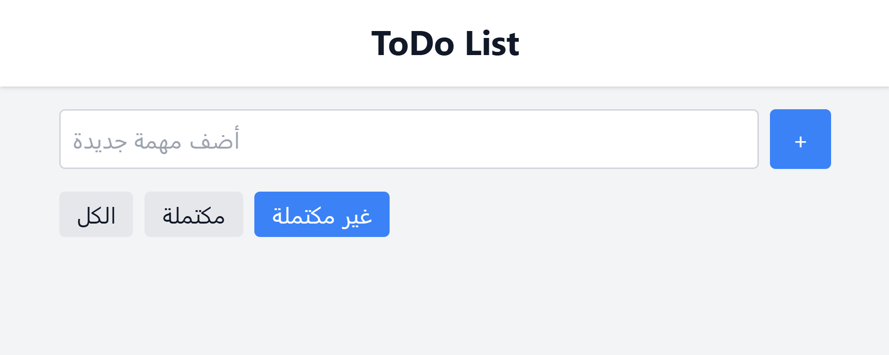
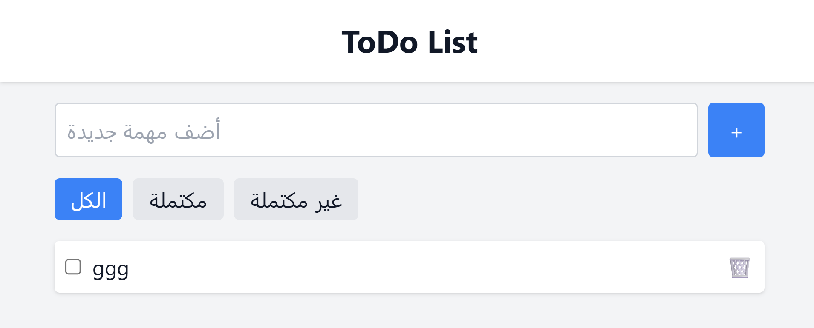
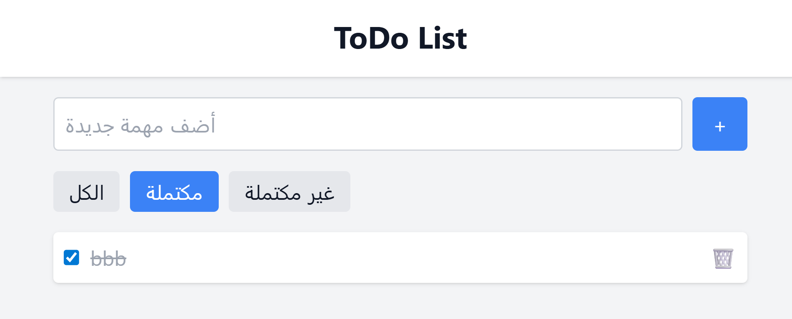
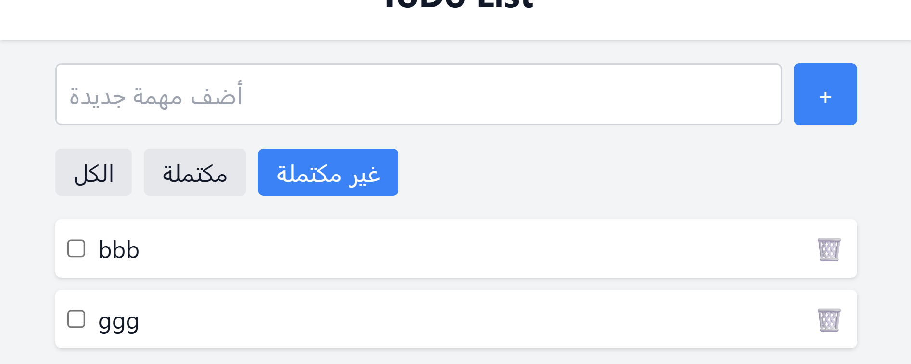

# My Fullstack App

This app is built using:

- **Frontend:** React.js, Vite, TailwindCSS  
- **Backend:** Node.js  
- **Database:** MongoDB (using MongoDB Compass)

## 🔍 App Screenshots

Here are some screenshots of the application:

### 📷 Screenshot 1

### 📷 Screenshot 2

### 📷 Screenshot 3

### 📷 Screenshot 4

